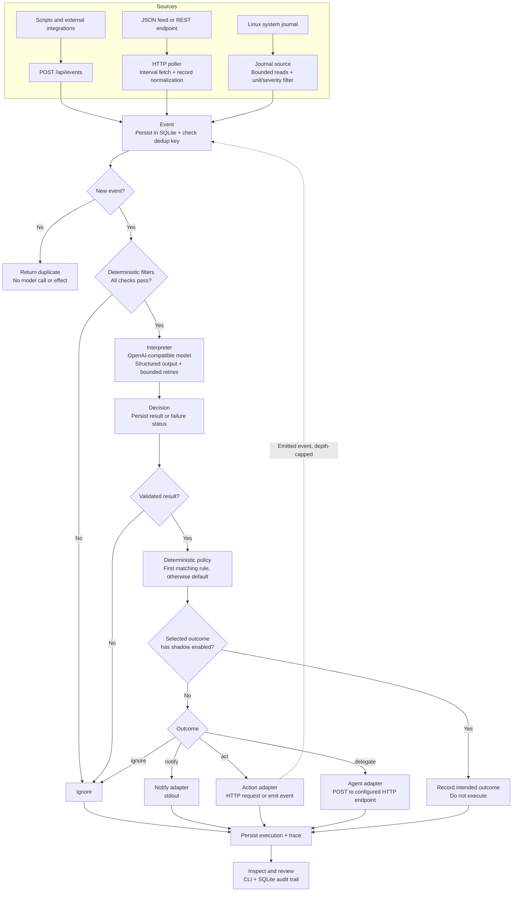

# mrmr

**A local-first, event-driven runtime for ambient AI.** Pronounced “murmur.”

Most AI tools wait for a prompt. mrmr starts with something happening: a service fails, a message arrives, or a feed publishes a new record. It turns that event into a structured model decision, applies deterministic policy, and either ignores it, notifies you, takes a bounded action, or delegates work to an agent.

**Cheap judgment for everyday events. Capable agents only when they deserve to wake up.**

> **LLM = judgment. Runtime = authority.**
>
> Models interpret events. Configuration and ordinary code determine which effects can run.

## How it works

The diagram shows the **implemented pipeline**, not the entire roadmap. All ingestion paths use the same runtime; no MCP server, message broker, or agent framework is required.



- **Sources detect, not judge.** The HTTP poller turns each JSON record into an ordinary Event; the journal source emits only selected unit/severity records. External integrations can submit normalized events through the API.
- **Events are stored before interpretation.** Deduplication suppresses repeat deliveries before spending inference. Emitted events also pass a causal-depth guard; depth greater than 10 forces ignore.
- **Filters avoid unnecessary inference.** Missing or incomparable fields fail the check, including `neq` checks.
- **Interpreters have no tools or side effects.** They return a schema-validated Decision. Invalid output or model failure routes to ignore, not policy.
- **Policy selects; adapters execute.** The model does not choose executable commands, endpoint URLs, or new permissions. Shadow is a modifier on a selected outcome, not another adapter.
- **The result is inspectable.** Stored events, decisions, executions, and traces explain the normal processing path. Duplicate deliveries return a duplicate trace but are not stored as separate events or traces.

Processing is currently **synchronous**: an API request waits for the pipeline, and each poller processes its records serially. SQLite persistence is not yet a recoverable worker queue. See [operational limits](#operational-limits) before relying on unattended actions.

## Current status

mrmr is early-stage software with a working vertical slice, HTTP polling, and a built-in Linux system-journal source.

| Area | Available now |
| --- | --- |
| Ingestion | `POST /api/events`; HTTP JSON polling; selected Linux system-journal events |
| Storage | SQLite events, decisions, executions, traces, source cursors, and human labels |
| Interpretation | OpenAI-compatible chat completions; structured-output requests; local schema validation and bounded retries |
| Filtering | Scalar `eq` / `neq` checks on event fields |
| Policy | ANDed conditions, first-match rules, explicit default |
| Outcomes | Ignore, stdout notify, HTTP action, emit-event, generic HTTP delegation, shadow |
| Review | Event listing, trace inspection, labeling, JSONL export, model evaluation |

**Not implemented:** MCP polling or tool calls, native SaaS integrations, built-in cron, XML RSS parsing, Discord/Telegram adapters, exec actions, permission/approval queues, web UI, multiple independently routed flows, or hot reload.

The included 50-event evaluation set is generated. The required quality gate—at least 50 labeled **real** events, with measured accuracy and false-ignore rate—has not yet been completed. A passing test suite is not evidence that a model is ready to make judgments on your events.

[IMPLEMENTATION.md](IMPLEMENTATION.md) describes the broader design and milestone behavior. Its future examples are not all valid configuration for today's binary.

## Let your agent set it up

Give your agent this repository and ask:

> Follow [SETUP.md](SETUP.md) to configure and verify mrmr for me. Keep effects disabled and ask before enabling network access or a background service.

The runbook covers environment checks, safe configuration, a real-model smoke test, persisted traces, duplicate suppression, and handoff. It does not require an agent-specific plugin or skill.

## Quick start

You need:

- **Go 1.27**, as declared in [go.mod](go.mod).
- An **OpenAI-compatible model endpoint** exposing `/chat/completions` beneath its configured base URL. Local inference is optional; using a remote endpoint sends event content to that endpoint.

Build and configure:

```bash
go build -o mrmr ./cmd/mrmr
cp mrmr.example.yaml mrmr.yaml
```

Edit `mrmr.yaml`:

- Set `server.addr` to `127.0.0.1:4242` for local-only access. The example's `:4242` listens on all interfaces.
- Set `models.fast-local.base_url` and `model` for your endpoint. Include `/v1` if your server requires it.
- If authentication is required, set the environment variable named by `api_key_env`. Do not put its value in YAML. Omit `api_key_env` for an unauthenticated endpoint.

Then start the runtime:

```bash
./mrmr run -config mrmr.yaml
```

In another terminal, send an event:

```bash
curl --fail-with-body http://127.0.0.1:4242/api/events \
  -H 'Content-Type: application/json' \
  -d '{
    "type": "test.message",
    "source": "curl",
    "subject": "production-api",
    "data": {
      "message": "The production API has returned 500 errors for five minutes."
    },
    "metadata": {
      "source_event_id": "quickstart-001"
    }
  }'
```

The example policy notifies stdout when the model classifies an incident with confidence above `0.85`; otherwise it ignores. The actual outcome depends on your model's judgment.

The JSON response includes `event_id` and `trace`, plus `decision`, `outcome`, or `duplicate` when applicable. Inspect a newly stored event using its returned ID:

```bash
./mrmr inspect evt_01... -config mrmr.yaml
```

Repeating the request with the same source and `source_event_id` returns a duplicate without invoking the model. Change the ID to submit a distinct event. A duplicate response's newly generated ID is not a stored event ID; use the original delivery's ID for inspection.

## Configuration

[mrmr.example.yaml](mrmr.example.yaml) is the complete starting point. One YAML file configures one shared filter/interpreter/policy pipeline, model endpoints, HTTP agent targets, and polling sources. All sources feed that pipeline; there is no `on:`-based flow routing yet.

Configuration is validated at startup; unknown YAML keys and unsupported adapter types are errors. Restart to apply changes.

### Filter first, interpret second

Filters check event fields before calling the model:

```yaml
filter:
  - field: source
    op: neq
    value: noise-bot
```

All checks must pass. `eq` is the default operator. Fields can address `type`, `source`, `subject`, or nested scalar values such as `data.author` and `metadata.origin`; an optional `event.` prefix is accepted.

`interpret` selects a model, a prompt, and a flat result schema. The supported field types are `string`, `number`, and `boolean`, with optional enums and numeric bounds. Every declared field is required, and extra result fields are rejected.

The client requests schema-constrained decoding. If the endpoint rejects that request with HTTP 400, it retries without the response format; runtime validation still applies. Invalid output gets at most one self-correction retry, and endpoint retries are bounded.

### Policy and outcomes

Rules evaluate from top to bottom. Conditions within a rule are ANDed; the first match wins. No match selects `default`.

```yaml
policy:
  - if:
      result.category: incident
      result.confidence: "> 0.85"
    then:
      notify:
        via: stdout
        message: "{{ .result.summary }}"

default:
  ignore: true
```

Conditions support literal equality and operator strings: `>`, `>=`, `<`, `<=`, and `!=`. There is no OR or nested condition language; use separate rules for alternatives.

| Outcome | Configuration under `then` | Behavior |
| --- | --- | --- |
| Ignore | `ignore: true` | Record the outcome; no external effect |
| Notify | `notify: {via: stdout}` | Print a message; optional Go `message` template |
| Act via HTTP | `action: {type: http, url: "http://127.0.0.1:9000/hook"}` | Send to a configured URL; default method is POST; optional `method` and `body` |
| Emit event | `action: {type: emit, event_type: incident.escalated}` | Re-enter the same pipeline with the decision result as event data |
| Delegate | `delegate: {agent: triage, prompt: "Investigate this event."}` | POST to `agents.triage.endpoint`; HTTP 2xx means accepted |

Notify messages and HTTP action bodies use Go templates such as `{{ .result.summary }}` and `{{ .event.id }}`. Delegation sends `{event_id, decision, prompt}`; the prompt is configured text, not a rendered template. Agent completion does not automatically return as a new event.

**Start with shadow when testing effects.** Add `shadow: true` beside the outcome in each rule you want suppressed:

```yaml
then:
  notify:
    via: stdout
    message: "{{ .result.summary }}"
  shadow: true
```

This records the selected notification without printing it. Shadow does not skip interpretation or storage. Setting shadow only in `default` does **not** suppress effects from matching policy rules.

## Ingesting events

### HTTP API

`POST /api/events` accepts:

| Field | Meaning |
| --- | --- |
| `type` | Required event type, for example `service.unhealthy` |
| `source` | Required producer identity; also scopes deduplication |
| `subject` | Optional entity the event concerns |
| `data` | Optional JSON object containing the event payload |
| `metadata` | Optional JSON object; use `source_event_id` for a stable delivery identity |

The API assigns event IDs and timestamps. Request bodies are limited to 1 MiB. Model or adapter failures are reported through the decision/trace, not necessarily a failing HTTP status; inspect the response rather than treating HTTP 200 as proof an effect succeeded.

Deduplication uses `(source, metadata.source_event_id)`. Without an explicit ID, it hashes the event type, subject, and data. Give genuinely separate occurrences distinct IDs, even if their payloads are identical.

This endpoint accepts **normalized events**, not arbitrary provider webhook formats. A script or integration must translate provider payloads and handle any required webhook authentication before submitting them.

### HTTP polling

Add a source to the same config:

```yaml
sources:
  - name: blog-feed
    type: http-poller
    url: "https://example.com/feed.json"
    every: 2m
    item_path: items
    cursor_field: id
    subject_field: title
    timestamp_field: published
    event_type: feed.item.published
    # bearer_token_env: FEED_TOKEN
```

- Polls immediately, then on the configured interval (minimum `1s`), with one serial loop per source.
- Performs an HTTP GET with a 15-second timeout and a 4 MiB response read limit. A failed fetch leaves the cursor unchanged; the next tick retries.
- Reads a JSON array at `item_path` (a dot-path); omit it for a top-level array. This is not an XML RSS/Atom parser.
- Preserves each record as `event.data`; the source name becomes `event.source`. Subject and timestamp fields refer to top-level record fields. Timestamps use RFC3339; missing or invalid timestamps fall back to now.
- Uses `cursor_field` as the dedup ID and stores a watermark in SQLite. Without it, payload-hash deduplication applies. Missing configured IDs are skipped; changes to a record with the same ID do not create a new event.
- Resolves an optional bearer token from the named environment variable at startup.

For compatible APIs, the URL may use `?after={{ .cursor }}`. **This is a basic watermark, not general pagination:** it is the string maximum of the fetched record IDs, not an opaque server continuation token. Substitution is literal, without URL escaping. The watermark changes only after every record is normalized and accepted by ingestion without cancellation; failed or malformed records hold the old cursor for the next poll, while successful records deduplicate on replay. A permanently malformed record holds the cursor until the source is corrected. This does not recover already-persisted, half-processed events after a crash or downstream persistence failure. Prefer overlapping recent-record feeds for initial dogfooding; do not rely on this for lossless incremental synchronization.

**MCP polling is planned, not available.** Setting `type: mcp-poller` fails validation. For now, an external MCP client can normalize records and submit them through `POST /api/events`.

### Linux system journal

One source in your mrmr configuration is enough—no forwarding script, timer, or second service:

```yaml
sources:
  - name: system-services
    type: systemd-journal
    units: [plexmediaserver.service, lfm25.service]
    priority: warning
    every: 30s
    event_type: system.service.warning
```

The [complete shadow-mode example](recipes/homelab-journal/mrmr.example.yaml) includes a model schema and policy. Edit its endpoint and unit names for your host; copying a source into another config does **not** automatically shadow that config's outcomes.

- Requires Linux, `journalctl` with `--lines=+N` support, and system-journal read permission. Startup checks these prerequisites before starting any sources. HTTP-only configurations remain portable.
- Selects exact **system** units and priorities at or above the chosen severity: `emerg`, `alert`, `crit`, `err`, `warning`, `notice`, `info`, or `debug`. No unit globs, user-journal support, remote journals, or automatic historical backfill. Hermes running as a user service is outside this initial slice.
- First activation checkpoints the current system-journal tail without interpreting history. Later starts resume the SQLite cursor. Changing the unit selection does not replay old records.
- Scans at most **100 system records per tick**, oldest first, applying unit/severity checks before ingestion. Unselected records advance the checkpoint without becoming Events. Busy journals can lag; shorten `every` (minimum `1s`) if needed. Each journalctl process is bounded to 15 seconds and 4 MiB stdout, and is reaped before model calls.
- Persists selected Events with the unit as `subject`, the original journal timestamp, and `data.unit`, numeric `data.priority`, and `data.message`. Manager-emitted service transitions are recognized through PID 1's `UNIT` field. Binary/oversized journal fields are marked `message_omitted`; text is capped at 4096 bytes with `message_truncated` when necessary. Other journal fields are not copied into event data.
- Uses the journal's opaque cursor as `metadata.source_event_id`. Failed batches retain the checkpoint; already stored records deduplicate. This does not repair the runtime's partial-processing/crash-recovery limitations.
- An inaccessible or vacuumed checkpoint causes a clear error, **not** a silent jump to the tail. Restore access/retained journals, or explicitly choose a new source name if abandoning the old position is acceptable. Old data is not deleted automatically.

**Permissions:** run `journalctl --system --no-pager -n 1 -o json --output-fields=__CURSOR` as the same account that runs mrmr. If access is denied or journalctl warns, have an administrator grant appropriate read access (often membership in `systemd-journal` or `adm`), then restart the login/service session. Group membership grants broad journal visibility: ask before changing it. Do not run mrmr as root to bypass this check. A host with no readable system journal entries also fails startup rather than pretending the source works.

Journal content may contain credentials or private application data. Unit filtering is not secret redaction. Start with shadow, use an approved model endpoint, and review selected records before trusting this source. Avoid selecting mrmr's own unit; the adapter excludes its current process's journal messages to prevent immediate feedback.

## Inspect, label, and evaluate

Review stored events and their traces:

```bash
./mrmr events -config mrmr.yaml -limit 20
./mrmr events -config mrmr.yaml -unlabeled
./mrmr inspect evt_01... -config mrmr.yaml
```

`events` emits one JSON object per row. `inspect` returns the stored event, decisions, executions, ordered trace, and human label if present.

Capture real events, label the expected judgment, then export a dataset:

```bash
./mrmr label evt_01... -config mrmr.yaml \
  -category incident -requires-action=true -outcome notify
./mrmr dataset export -config mrmr.yaml \
  -output testdata/real-eval.jsonl
./mrmr eval -config mrmr.yaml -dataset testdata/real-eval.jsonl
```

Relabeling replaces the previous label. The current labeling/evaluation workflow targets `ignore` and `notify`; it is not an action/delegation benchmark.

For prompt development before real data is available:

```bash
./mrmr eval -config mrmr.yaml -dataset testdata/generated-eval.jsonl
```

Evaluation calls the interpreter and evaluates policy without executing effects or writing runtime events. It does not run pre-model filters. It reports category, requires-action, and outcome accuracy plus the false-ignore rate. Use the generated set as a baseline, then grade at least 50 representative real events against your own acceptance thresholds before trusting a flow.

Exports contain complete event payloads. Real evaluation datasets are ignored by Git by default, but inspect and anonymize them before sharing.

## Operational limits

**Use on a trusted local network, initially with ignore, stdout, or shadow outcomes.**

- **No API authentication.** Prefer a loopback bind. For remote access, use a trusted private network and appropriate access controls; do not expose port 4242 directly to the internet. Ingestion can trigger configured actions.
- **No permission or approval layer yet.** Configured policy is the current authority boundary. There is no approval queue, automatic stale-event action downgrade, or action sandbox.
- **Persistence is not crash recovery.** There is no queue replay for half-processed events. Effects run before execution records are written; a crash can leave incomplete processing or an audit gap. Deduplication is not an exactly-once execution guarantee.
- **Polling is deliberately basic.** No general pagination, arbitrary cursor ordering, or durable ingestion retry queue. Slow interpretation delays the next record in that source.
- **Stored data can be sensitive.** Events, structured decisions, and traces persist in SQLite; API processing also prints response traces. Full prompts and successful raw model responses are not stored as separate artifacts, but endpoint error bodies can appear in errors/traces. Protect the database, logs, and exports.
- **Secrets belong outside config.** Use `api_key_env` for model authentication and `bearer_token_env` for pollers. Do not put credentials in URLs, event payloads, or prompts.

## Deployment

The runtime is one Go binary plus a YAML file and SQLite database. No Redis, Postgres, or cloud account is required.

For a Linux x86-64 host:

```bash
GOOS=linux GOARCH=amd64 go build -o mrmr ./cmd/mrmr
scp mrmr mrmr.yaml home-server:~/mrmr/
```

Create the destination directory first; use `GOARCH=arm64` for an ARM64 host. On the host, set an appropriate bind address and an absolute `db.path` in the config, then supply any referenced credentials through the service environment.

Example systemd user unit at `~/.config/systemd/user/mrmr.service`:

```ini
[Unit]
Description=mrmr ambient event runtime
After=network-online.target

[Service]
WorkingDirectory=%h/mrmr
ExecStart=%h/mrmr/mrmr run -config %h/mrmr/mrmr.yaml
Restart=on-failure

[Install]
WantedBy=default.target
```

```bash
systemctl --user daemon-reload
systemctl --user enable --now mrmr
journalctl --user -u mrmr -f
```

A user service needs lingering enabled if it should remain running after logout. The unit above does not provision secrets; arrange their environment separately before starting an authenticated setup.

## Roadmap

The [development phases](IMPLEMENTATION.md#development-phases) are the source of truth; this is direction, not a list of shipped capabilities:

1. **Prove the loop:** complete real-event evaluation of the core pipeline.
2. **Useful daemon:** expand sources, notifications, actions, retries, and permissions. HTTP polling is already implemented.
3. **Local UI:** event timeline, trace inspection, configuration, approvals, and health.
4. **Real integrations:** build adapters from actual dogfooding needs, including an MCP poller.
5. **Delegation and ecosystem:** first-class agent integrations and completion events; SDKs only when real implementations justify them.

mrmr is not a general-purpose workflow engine, an agent framework, or an MCP platform. The core stays small: **Source → Event → Interpreter → Decision → Policy → Outcome → Adapter.**

## Development

```bash
go test ./...
go build ./...
```

Code lives under `cmd/mrmr` (CLI and HTTP server) and `internal` (configuration, source, event, filter, model, policy, runtime, and storage). Tests use local fixtures and mock HTTP servers; no real model endpoint or credentials are required.

See [AGENTS.md](AGENTS.md) for contribution constraints and [IMPLEMENTATION.md](IMPLEMENTATION.md) for the design.

## License

[MIT](LICENSE)
